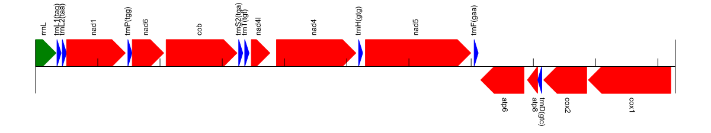
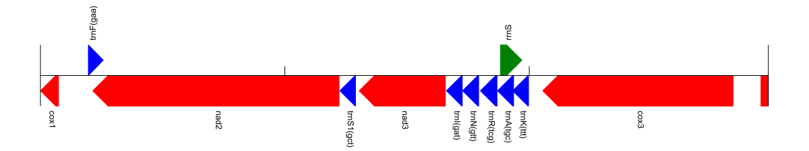

## MITOBIM assembly for Micrelenchus tenebrosus

###Summary


...
I tried a couple of approaches. One was to use MITOBIM that iteratively construct an assemblym and one was to use SPADES (an assembler). SPADES performed better by getting more large scaffolds but both left gaps,
...


### SPADES

Spades is a local assembler. I tried with different subset of reads but it performed best with all the reads.

```
./spades.py --pe1-1 ~/projects/Micrelenchus/trimmed_reads/2420-05-11-01_S5_L001_R1_001_TRIMMED.fastq.gz   --pe1-2 ~/projects/Micrelenchus/trimmed_reads/2420-05-11-01_S5_L001_R2_001_TRIMMED.fastq.gz   -o spadestestMtenebrosus
```


###MITOBIM

I obtained a lot of contigs, I used them as. a reference for MITOBIM in an attempt to close the gaps.

first I subsample the reads to 5% of the original files because MITOBIM does not work:


```
mkdir -p  Mtenebrosus/spaderef

seqtk sample -s100 trimmed_reads/2420-05-11-01_S5_L001_R1_001_TRIMMED.fastq.gz  0.05 >  Mtenebrosus/2420-05-11-01_S5_L001_R1_001_TRIMMED0005.fastq 
seqtk sample -s100 trimmed_reads/2420-05-11-01_S5_L001_R2_001_TRIMMED.fastq.gz  0.05 >  Mtenebrosus/2420-05-11-01_S5_L001_R2_001_TRIMMED0005.fastq
~/repos/scripts/Micrelenchus/interleave-fasta.py  Mtenebrosus/2420-05-11-01_S5_L001_R1_001_TRIMMED0005.fastq  Mtenebrosus/2420-05-11-01_S5_L001_R2_001_TRIMMED0005.fastq   > Mtenebrosus/2420-05-11-01_S5_L001_R2_001_TRIMMED_interleavedsub005.fastq

```

I took the 10 first nodes/scaffolds of the spades assembly and use them as a reference for MITOBIM by putting them in a file reffromspades/Mtenebrosus_10first.fa 


```
cd Mtenebrosus/spaderef
MITObim.pl --denovo -end 100 --pair -sample Mtenebrosus -ref refspades -readpool  ../2420-05-11-01_S5_L001_R2_001_TRIMMED_interleavedsub005.fastq --clean --quick ../../reffromspades/Mtenebrosus_10first.fa 
```

7 contigs left, let's try something else

**Try2 from UCI**

I made a small with  12S, 16S and COI available on GENBANK in referencesformitobim/Microlenchus_tenebrosus_bait.fa

```
mkdir -p Mtenebrosus/3genesref
cd Mtenebrosus/3genesref
MITObim.pl --denovo -end 100 --pair -sample Mtenebrosus -ref refspades -readpool  ../2420-05-11-01_S5_L001_R2_001_TRIMMED_interleavedsub005.fastq --clean --quick ../../referencesformitobim/Microlenchus_tenebrosus_bait.fa
```

That was better!

```
running denovo assembly using MIRA

readpool contains 10181 reads
assembly contains 8 contig(s)
min contig length: 191 bp
max contig length: 9066 bp
avg contig length: 1861 bp
find details on individual contigs in: /gpfs1m/projects/uoo00116/projects/Micrelenchus/Mtenebrosus/3genesref/iteration8/Mtenebrosus-refspades_assembly/Mtenebrosus-refspades_d_info/Mtenebrosus-refspades_info_contigstats.txt
```	

What if I take slightly more reads? (10%)


```

seqtk sample -s100 trimmed_reads/2420-05-11-01_S5_L001_R1_001_TRIMMED.fastq.gz  0.1 >  Mtenebrosus/2420-05-11-01_S5_L001_R1_001_TRIMMED01.fastq 
seqtk sample -s100 trimmed_reads/2420-05-11-01_S5_L001_R2_001_TRIMMED.fastq.gz  0.1 >  Mtenebrosus/2420-05-11-01_S5_L001_R2_001_TRIMMED01.fastq
~/repos/scripts/Micrelenchus/interleave-fasta.py  Mtenebrosus/2420-05-11-01_S5_L001_R1_001_TRIMMED01.fastq  Mtenebrosus/2420-05-11-01_S5_L001_R2_001_TRIMMED01.fastq   > Mtenebrosus/2420-05-11-01_S5_L001_R2_001_TRIMMED_interleavedsub01.fastq

```
```
mkdir -p Mtenebrosus/3genesref01
cd Mtenebrosus/3genesref01
MITObim.pl --denovo -end 100 --pair -sample Mtenebrosus -ref refspades -readpool  ../2420-05-11-01_S5_L001_R2_001_TRIMMED_interleavedsub01.fastq --clean --quick ../../referencesformitobim/Microlenchus_tenebrosus_bait.fa
```


better:
```
running denovo assembly using MIRA

readpool contains 21174 reads
assembly contains 9 contig(s)
min contig length: 217 bp
max contig length: 10270 bp
avg contig length: 1699 bp
find details on individual contigs in: /gpfs1m/projects/uoo00116/projects/Micrelenchus/Mtenebrosus/3genesref01/iteration9/Mtenebrosus-refspades_assembly/Mtenebrosus-refspades_d_info/Mtenebrosus-refspades_info_contigstats.txt
```
...

even more reads? (15%)

```

seqtk sample -s100 trimmed_reads/2420-05-11-01_S5_L001_R1_001_TRIMMED.fastq.gz  0.15 >  Mtenebrosus/2420-05-11-01_S5_L001_R1_001_TRIMMED015.fastq 
seqtk sample -s100 trimmed_reads/2420-05-11-01_S5_L001_R2_001_TRIMMED.fastq.gz  0.15 >  Mtenebrosus/2420-05-11-01_S5_L001_R2_001_TRIMMED015.fastq
~/repos/scripts/Micrelenchus/interleave-fasta.py  Mtenebrosus/2420-05-11-01_S5_L001_R1_001_TRIMMED015.fastq  Mtenebrosus/2420-05-11-01_S5_L001_R2_001_TRIMMED015.fastq   > Mtenebrosus/2420-05-11-01_S5_L001_R2_001_TRIMMED_interleavedsub015.fastq

```
```
mkdir -p Mtenebrosus/3genesref015
cd Mtenebrosus/3genesref015
MITObim.pl --denovo -end 100 --pair -sample Mtenebrosus -ref refspades -readpool  ../2420-05-11-01_S5_L001_R2_001_TRIMMED_interleavedsub015.fastq --clean --quick ../../referencesformitobim/Microlenchus_tenebrosus_bait.fa
```

```

readpool contains 31603 reads
assembly contains 9 contig(s)
min contig length: 182 bp
max contig length: 10282 bp
avg contig length: 1694 bp
find details on individual contigs in: /gpfs1m/projects/uoo00116/projects/Micrelenchus/Mtenebrosus/3genesref015/iteration7/Mtenebrosus-refspades_assembly/Mtenebrosus-refspades_d_info/Mtenebrosus-refspades_info_contigstats.txt
```

weirdly enough we get two and not three fragments as expected fom the three pairs of primers. That could be the case if the 2 big merge together. 

Weirdly with the annotation, some features  are overlapping


