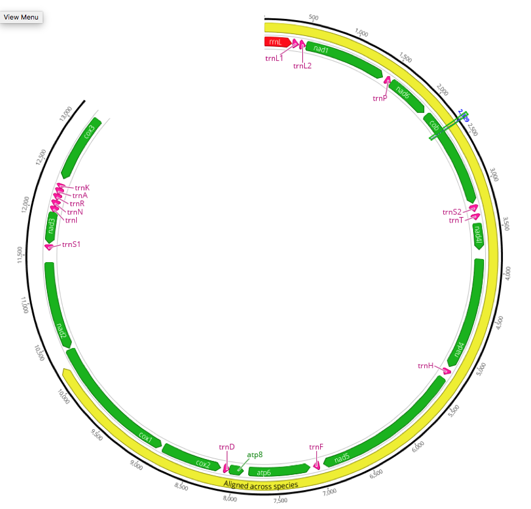

## Description

### Overview

Micrelenchus huttoni mitogenomics. We have one species 2x150bp. This is a modified version of https://github.com/ldutoit/Micrelenchus applied to Micrelenchus huttoni alone.


### Key Players

Kirsten Donald 
Hamish Spencer

### What are my objectives ?

My objectives are to assemble mitochondria from 1 species. If needed I'll pull extra data from past species. After that, I will estimate how much data is needed for reliable SNP calling.

The data is Illumina from PCR amplified mitochondria for 4 species. I can try to assemble them on their own. There is also one extra reference assembly from a collaborator for Micrelencus tesselatus (=Cantharidus.tesselatus.fasta).
 
### Physical location of the data


Source files archived on hcs:

storage.hcs-p01.otago.ac.nz/sci-bioinformatics-project-archive

### Source files

  
### Output files


## Analyses Description

### 1. cleaning

The cleaning is done with *trimming_PE.sh* using Trimmomatic.


### 2. MITOBIM mitochondrial assemblies for the four species from a COI seed


We first identified bait sequences from NCBI to be able to run MITOBIM on it, a software creating an assembly by iterative mapping to a reference that updates itself. We were able to retrieve partial or complete sequences for COI, 12S rRNA and 16S rRNA for the four species ( see ref in listofseqforbaiting.md).


Micrelenchus_huttonii_mitobim.md

We expected different results for different samples since they were sequenced with different number of primers:

```
the Micrelenchus samples were either amplified in 2 or 3 fragments as follows;

Micrelenchus huttonii (2420-06)
1. 16S.R2 - ND4.F 
2. 16S.F - COI.R
 

```

**We obtained things in 2 fragments for M. tesselatus and M. tenebrosus and 1 fragment for M. huttonii and the outgroup.**

 I extracted all of that and put it into a folder "outputbestmitobim"

The annotation using MITOS corresponded well to a reference obtain by a collaborator group for M. tesselatus ( see below).


### 3. remapping to the best of the MITOBIM results and checking coverage of mapping


I made a consensus sequence out of the mapping results. First, I mapped all reads to the assembled draft using the script remapping.py. And then I made a consensus sequence using the command line script MakeConsensus.sh run through run_MakeConsensus.sh.


### 4. Extending with known sequence.

First, I checked the coverage of each bam consensus to find where the edge assembly become doubtful, I do this by identifying where the coverage drops as described in *coveragecheck.md*. We then remove this bits using removeedges using *removeedges.py* and the info in *coveragecheck.md*

After this consensus I aimed at improving the edge by adding known COI and 16S when possible. I tried to align each species and each scaffold with their COI and 16S sequence independently using MAAFT. If that could be done unambiguously, I added the bits of 16S and CO1 at the ends of the contigs.  See **extendingbyaligningtoknownseq.md**.

The long contig ( contig 1) was extended in 2 cases. The short one never.


### 5. alignment with MAAFT, check for both 2 and 3 extract the best results

We aligned our sequences using MAAFT v7 and created 3 output files:
```
Micrelenchusconsensus_long_4sp_MAAFT_extended.fa : Contains an alignment for the long fragment based on sequences that were manually extended for the 4 species
Micrelenchusconsensus_long_4sp_MAAFT_NOTextended.fa: Contains an alignment for the long fragment based on sequences that were NOTmanually extended for the 4 species 
Micrelenchusconsensus_short_2sp_MAAFT.fa: Contains an alignment for the long fragment based on sequences that were NOTmanually extended for the 2 species with more sequence 
```


### 6. Visualization

Using Geneious, we were able to merge the two fragments of M tenebrosus as one long linear fragment of 13,278 bp, this was saved in the file [output_files/Mtenebrosus31278.fa](output_files/Mtenebrosus31278.fa)  and reannotated it using MITOS (output is [output_files/Mtenebrosus31278.gff](output_files/Mtenebrosus31278.gff). Notably, the small rRNA subunit was annotated to a region of only 89bp overlapping with tRNA and this has been edited out manually from the gff

Using the Geneious software, we created one circular genome visualization:
 

It includes the 13278bp of tenebrosus. A higher resolution figure is available in pdf. We  left an empty 3000bp bp at the end. This is the approximate length of the missing sequences suggested when aligned to the complete mitochondrion of the distant Gibbula umbilicalis (GENBANK: KX646541.1 ). All the files necessary are within the folder [(figure_cache/circularplot/]((figure_cache/circularplot/)


### References

Bolger AM, Lohse M, Usadel B. Trimmomatic: a flexible trimmer for Illumina sequence data. Bioinformatics. 2014;30(15):2114-2120. doi:10.1093/bioinformatics/btu170.

Katoh, Standley 2013 (Molecular Biology and Evolution 30:772-780) 
MAFFT multiple sequence alignment software version 7: improvements in performance and usability. 
(outlines version 7)

Heng Li, Bob Handsaker, Alec Wysoker, Tim Fennell, Jue Ruan, Nils Homer, Gabor Marth, Goncalo Abecasis, Richard Durbin, 1000 Genome Project Data Processing Subgroup; The Sequence Alignment/Map format and SAMtools, Bioinformatics, Volume 25, Issue 16, 15 August 2009, Pages 2078–2079, https://doi.org/10.1093/bioinformatics/btp352

“Picard Toolkit.” 2018. Broad Institute, GitHub Repository. http://broadinstitute.github.io/picard/; Broad Institute

Li H. and Durbin R. (2009) Fast and accurate short read alignment with Burrows-Wheeler Transform. Bioinformatics, 25:1754-60. [PMID: 19451168]

Hahn C, Bachmann L, Chevreux B. Reconstructing mitochondrial genomes directly from genomic next-generation sequencing reads—a baiting and iterative mapping approach. Nucleic Acids Research. 2013;41(13):e129. doi:10.1093/nar/gkt371.
